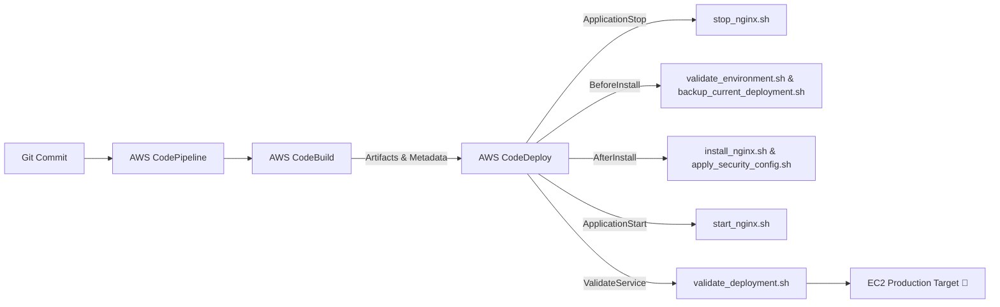

# 🚀 AWS DevOps Real-Time Deployment | Dev → Pre-PROD → Production  


  

## 📌 Overview  

This repository provides a **production-ready, real-time AWS DevOps deployment pipeline** designed to automate application releases across three environments:  

- **Development (Dev)** – Continuous integration, shell linting, and fast iteration  
- **Pre-Production (Staging)** – Quality assurance, security scanning, and pre-release validation  
- **Production (Prod)** – High-reliability deployment with zero downtime and automated rollbacks  

---

## 🏗️ Architecture & Pipeline Flow



---

## 🆕 Version 2.1 Enhancements

✅ **CodeDeploy EC2 Lifecycle Compliance**: Standardized to official lifecycle hooks (`ApplicationStop`, `BeforeInstall`, `AfterInstall`, `ApplicationStart`, `ValidateService`).  
✅ **CodeBuild Modernization**: Upgraded to Node.js 20 & Python 3.11 runtimes; eliminated invalid in-container `systemctl` calls in favor of static linting, YAML verification, and build metadata generation (`build-info.json`).  
✅ **Nginx Security Hardening**: Validated `http` context headers, rate limiting zones (`limit_req_zone`), buffer overflow protections, and restricted file location rules.  
✅ **Multi-Distro Script Support**: Scripts auto-detect and support Debian/Ubuntu (`apt-get`) and Amazon Linux 2023/RHEL (`dnf`/`yum`).  
✅ **Automated Rollback & Backup**: `backup_current_deployment.sh` creates compressed backups of `/var/www/html` with automated 5-version retention.  
✅ **Modern UI & Accessibility**: Glassmorphic, mobile-responsive web dashboard with real-time status indicators and JSON-LD SEO metadata.  

---

## 📋 Project Structure

```
├── appspec.yml                  # AWS CodeDeploy application specification
├── buildspec.yml                # AWS CodeBuild build specification
├── index.html                   # Modern application dashboard
├── nginx-security.conf          # Nginx security hardening configuration
├── environments/                # Environment-specific configuration profiles
│   ├── dev.env                 # Development environment settings
│   ├── staging.env             # Staging environment settings
│   └── prod.env                # Production environment settings
├── scripts/
│   ├── stop_nginx.sh           # Hook: ApplicationStop (graceful shutdown)
│   ├── validate_environment.sh # Hook: BeforeInstall (system & resource checks)
│   ├── backup_current_deployment.sh # Hook: BeforeInstall (tar.gz backup & rotation)
│   ├── install_nginx.sh        # Hook: AfterInstall (multi-distro install)
│   ├── apply_security_config.sh# Hook: AfterInstall (Nginx conf & permissions)
│   ├── start_nginx.sh          # Hook: ApplicationStart (service startup & checks)
│   ├── validate_deployment.sh  # Hook: ValidateService (end-to-end HTTP/header tests)
│   └── load_environment_config.sh # Environment configuration loader utility
└── README.md                   # Project documentation
```

---

## 🔧 Deployment Hooks Breakdown

| CodeDeploy Hook | Script | Purpose | Timeout |
|---|---|---|---|
| `ApplicationStop` | `scripts/stop_nginx.sh` | Gracefully stops or reloads existing Nginx instance | 60s |
| `BeforeInstall` (1) | `scripts/validate_environment.sh` | Verifies disk space, memory, root permissions, network | 300s |
| `BeforeInstall` (2) | `scripts/backup_current_deployment.sh` | Archives previous web directory with rotation | 120s |
| `AfterInstall` (1) | `scripts/install_nginx.sh` | Idempotent package install with retry and lock management | 300s |
| `AfterInstall` (2) | `scripts/apply_security_config.sh` | Applies security configs, headers, and file permissions | 120s |
| `ApplicationStart` | `scripts/start_nginx.sh` | Starts Nginx, enables on boot, and verifies socket | 180s |
| `ValidateService` | `scripts/validate_deployment.sh` | Validates HTTP 200, HTML body, and security headers | 120s |

---

## 🛠️ Configuration Management

Load environment profiles on-demand:

```bash
# Load Development Profile
./scripts/load_environment_config.sh dev

# Load Staging Profile
./scripts/load_environment_config.sh staging

# Load Production Profile
./scripts/load_environment_config.sh prod
```

---

## 🚀 Quick Start & Local Testing

### Prerequisites
- AWS Account with CodePipeline, CodeBuild, and CodeDeploy permissions
- EC2 Instance with AWS CodeDeploy Agent installed
- Git & Bash

### Syntax & Build Dry-Run
```bash
# Verify all shell scripts
for f in scripts/*.sh; do bash -n "$f" && echo "✅ $f valid"; done

# Verify environment profiles
for e in environments/*.env; do bash -n "$e" && echo "✅ $e valid"; done
```

---

## 🛠️ Author & Credits

This project is built and maintained by **[Harshhaa](https://github.com/NotHarshhaa)** 💡.  

- **GitHub**: [@NotHarshhaa](https://github.com/NotHarshhaa)  
- **Blog**: [Hashnode](https://blog.prodevopsguy.xyz)  
- **LinkedIn**: [Harshhaa](https://linkedin.com/in/harshhaa)  

---

## 🔖 License

This project is licensed under the MIT License - see the [LICENSE](LICENSE) file for details.
